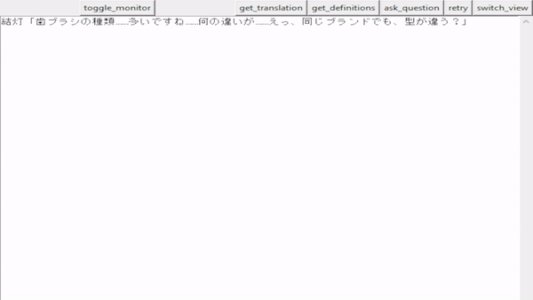
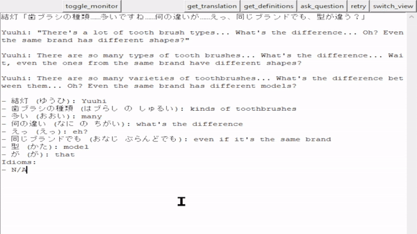

# clipboard_translate
Copy Japanese sentences and automatically generate translations or vocabulary lists using AI.
Useful with a text hooking utility like Textractor.

  
Live translations, vocabulary lists, 'reasoning-enhanced translations'.

  
Ask questions, with the previous lines as context. Uses ctrl+enter as a shortcut.

Additional features:  
- Keeps a history of previous lines, so that translations can be more accurate.  
- Allows for supplying a 'context' for a description of what you're translating (e.g. "This is a twitter thread about [xyz]", or a list of characters in a story).

## Setup
1. Install with `pip install -r requirements.txt` and `python -m unidic download`.
2. Edit `settings.toml` to enable what you want.
3. For AI behaviors, you can connect to Gemini, Claude or any OpenAI compatible service by editing `settings.toml` with your api keys.
4. Start the app.
      ```commandline
      # Web version. Copy the url shown into your browswer.
      python jp_vocab_monitor_web.py [story_name]
   
      # Alternatively, you can use the non-web version.
      python jp_vocab_monitor_web.py [story_name]
      ```

## Configuration
You can also configure the program by creating a `user.toml` in the root directory. Then, settings will be loaded from `settings.toml` first, with any overlapping values overridden by `user.toml`.

Per story configuration is also possible by adding a `[story_name].toml` in the `settings` folder. In particular, you can add a synopsis to guide the AI with the `ai_translation_context` key.

## Suggested Models
I've seen decent translation quality with the following local models:  
- [vntl-llama3-8b](https://huggingface.co/lmg-anon/vntl-llama3-8b-hf) 
- [Qwen3-30B-A3B-Instruct-2507](https://huggingface.co/Qwen/Qwen3-30B-A3B-Instruct-2507)

If you're going to _ask_ the AI questions about Japanese, I'd recommend using Google's Gemini via API (Gemini Flash's accuracy is great; and the free-tier rate limiting should be fine for reading).

## Credits
For definitions and katakana readings in non-ML mode, we use a modified [Jitendex](https://github.com/stephenmk/Jitendex), which is under the [ShareAlike license](https://creativecommons.org/licenses/by-sa/4.0/).

For breaking sentences into words, we use [fugashi](https://github.com/polm/fugashi).
